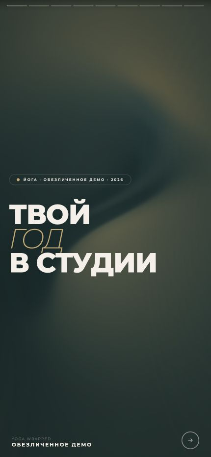
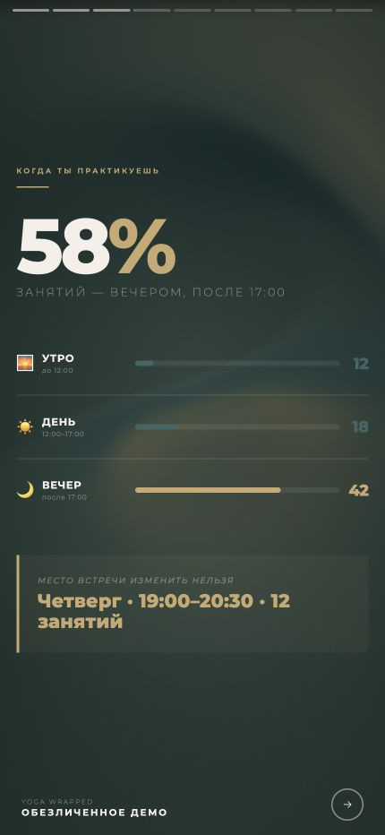
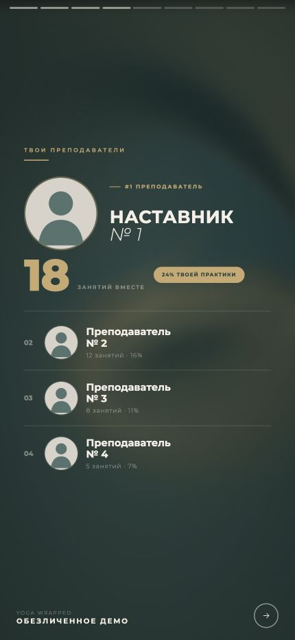
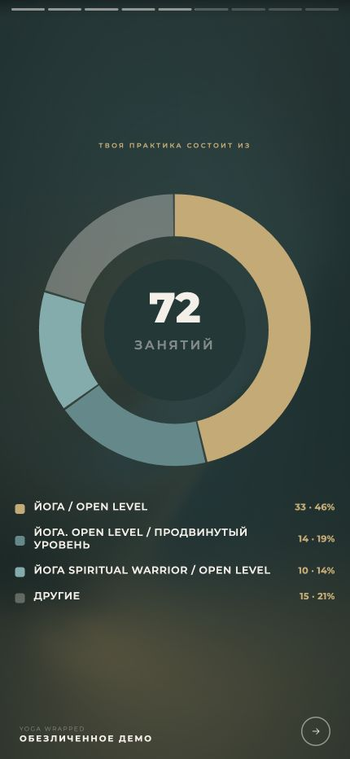

# Итоги года для йога-студии

Telegram-бот и мини-апп, которые превращают историю посещений занятий в персональный интерактивный “итог года”: слайды, анимации, статистика практики и карточки, которые удобно сохранить для соцсетей.

> Публичная версия для резюме: все имена, название студии, данные посещений и изображения преподавателей обезличены. В демо используются синтетические данные.

## Демо

[Открыть демо](https://lllllllleo495.github.io/joga_wrapped/)

Визуализация сделана в формате Telegram Mini App: прогресс слайдов, свайпы, тап по краям экрана, удержание пальцем для паузы, анимированные счетчики и адаптация под телефон. В публичном репозитории показан обезличенный preview, без живого доступа к пользовательским данным.

## Пример визуализации

Актуальный интерфейс слайдов из бота. Для публичного примера название студии, имена, фотографии и статистика заменены на обезличенные синтетические данные. Нажмите на изображение, чтобы открыть его в полном размере.

  
  

  
  

## Для чего этот бот

Пользователь запускает анализ в Telegram, бот собирает историю занятий из личного кабинета, агрегирует статистику и открывает мини-апп с персональными итогами года. После просмотра интерактивной истории пользователь может получить статичные карточки в чат, чтобы сохранить или опубликовать их без скриншотов.

## Что показывает Wrapped

- сколько занятий и часов практики было за год;
- какие месяцы были самыми активными;
- с какими преподавателями пользователь занимался чаще всего;
- какие типы классов встречались чаще;
- итоговую историю в формате мобильных слайдов.

## Что было важно в реализации

- Изоляция данных: каждый пользователь видит только свои итоги.
- Минимизация хранения: для повторного просмотра достаточно агрегированной статистики, без сырых CSV посещений.
- Мобильный UX: слайды рассчитаны на Telegram WebView, свайпы, паузу удержанием и аккуратный progress bar.
- Шеринг: после анимированной истории можно отправить карточки в чат.
- Прод-деплой: VPS, nginx, systemd, webhook-режим Telegram-бота.

## Технологии

- Python Telegram Bot
- Playwright
- SQLite
- aiohttp
- HTML, CSS, vanilla JavaScript
- nginx, systemd, VPS

## Приватность публичного демо

В этом репозитории нет реальных токенов, телефонов, CSV-файлов, ФИО, фотографий преподавателей, названия реальной студии и пользовательских данных. Демо показывает только интерфейс и механику продукта.
